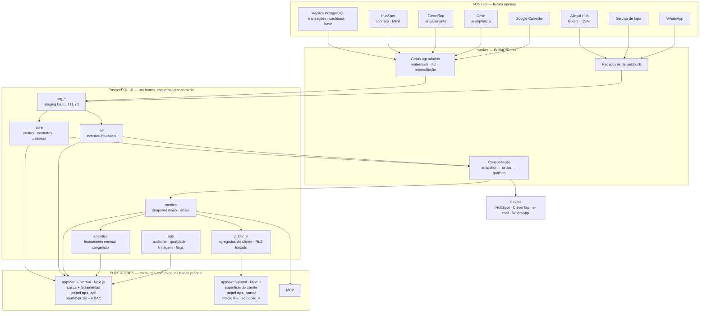

# Alloyal Pulse — Plataforma de Ferramentas de Operação

| | |
|---|---|
| Documento | 00 — Plataforma (chassi) |
| Versão | 2.0 |
| Data | 26 de julho de 2026 |
| Substitui | Partes II e III do PRD Alloyal Success v1.0 |
| Documentos irmãos | `01-PRD-Alloyal-Success.md` · `02-Decisoes-e-Verificacoes-Abertas.md` |
| Status | Aguardando 2 verificações de dados (V-01, V-02) e 6 decisões de bootstrap (seção C do doc 02) |

---

## 0. Por que este documento existe

O PRD anterior descrevia um sistema. O que a Alloyal está construindo é **uma plataforma interna de ferramentas de operação**, da qual o Alloyal Success é a primeira ferramenta. Outras virão.

A diferença não é semântica. Ela decide:

- **onde o código mora** — um monorepo com chassi compartilhado, não um repositório por ferramenta;
- **o que vale construir bem agora** — identidade, plataforma de dados e design system são construídos uma vez e amortizados por N ferramentas; um módulo de domínio não é;
- **o que não vale construir agora** — a armadilha oposta é gastar 6 meses em chassi e entregar zero valor. A seção 2 define a regra que impede isso.

Este documento é o contrato do chassi. O documento 01 é o primeiro produto que roda sobre ele.

---

## 1. O que é o Alloyal Pulse

> Superfície única onde o time interno da Alloyal opera o negócio, sobre uma base de dados única e governada.

**Princípio de identidade:** uma pessoa faz login uma vez, vê uma casca (shell), e as ferramentas são módulos dentro dela. Não são N produtos com N logins, N menus e N conceitos de "cliente".

**Ferramenta 1 — Alloyal Success (CS/CX).** Documento 01.

**Candidatas seguintes** (não especificadas, listadas para orientar o chassi): operação comercial/RevOps, operação de parcerias e catálogo, operação financeira de repasses, qualidade de atendimento, cockpit de produto. Nenhuma delas está no escopo. A única obrigação do chassi é **não impedi-las**.

**Relação com o Alloyal Hub:** o Hub é atendimento (ticket, base de conhecimento, fila). Ele permanece onde está e é **fonte de dados** para o Pulse, não é absorvido. Ver não-objetivos no documento 01.

**Relação com o EnableOS:** mesma stack — Next.js, Prisma, Postgres — verificada no código do `alloyal-enable` na VM, para que a migração futura mova módulos em vez de reescrevê-los (ADR-005). O PRD v1.0 afirmava paridade e listava NestJS, que o EnableOS não usa.

---

## 2. A regra que impede o chassi de virar o projeto

Toda plataforma interna morre de uma das duas mortes: ou não existe (cada ferramenta reinventa auth e dados) ou vira o produto (12 meses de framework, nenhum usuário).

**Regra de dois.** Uma capacidade só entra no chassi quando:

1. está na lista de **chassi desde o dia 1** (tabela 3, coluna "D1"), ou
2. uma **segunda** ferramenta precisa dela.

Até lá, ela mora dentro da ferramenta que a pediu, em módulo próprio, com fronteira limpa. Promover depois é refatoração barata. Antecipar é abstração errada — sempre.

**Corolário para o time:** ninguém precisa pedir permissão para resolver o problema dentro do Success. O que se pede é que a fronteira seja explícita, para que a promoção seja mecânica.

---

## 3. Capacidades do chassi

| # | Capacidade | O que entrega | D1 | Regra de dois |
|---|---|---|---|---|
| P1 | **Identidade e acesso** | SSO Google Workspace, papéis por grupo, sessão, auditoria de acesso | ✅ | — |
| P2 | **Plataforma de dados** | Ingestão, snapshot diário, dicionário como código, linhagem, qualidade, fechamento | ✅ | — |
| P3 | **Design system** | Tokens, componentes, padrões de estado, acessibilidade | ✅ | — |
| P4 | **Observabilidade** | Log estruturado, tracing, painel de pipeline, alarme | ✅ | — |
| P5 | **Auditoria** | Trilha imutável de quem fez o quê, em qual cliente, quando | ✅ | — |
| P6 | **Entrega** | Monorepo, CI, migrations, feature flags, deploy, rollback | ✅ | — |
| P7 | **Motor de trabalho** | Filas, itens de ação, SLA, supressão, teto de carga | — | Extrai quando a 2ª ferramenta tiver fila |
| P8 | **Superfície do cliente** | Portal externo com isolamento de tenant | — | Extrai quando a 2ª ferramenta expuser dado a cliente |
| P9 | **Notificações e canais** | E-mail, WhatsApp, notificação interna | — | Extrai na 2ª ferramenta |
| P10 | **Camada de agentes (MCP)** | Operação por agente, sem ação destrutiva | — | Nasce no Success, promovido depois |

P7 e P8 são construídos **dentro do Success** com fronteira de módulo (`modules/work-engine`, `apps/web-portal`) e promovidos a `packages/` quando a segunda ferramenta chegar.

---

## 4. Arquitetura

### 4.1 Topologia



**Duas leituras obrigatórias do diagrama.** (1) Nenhuma tela consulta fonte externa ao vivo — tudo passa por staging, é materializado e só então servido. (2) Não existe seta do gateway externo para qualquer coisa que não seja `public_v`. Isso é estrutura, não convenção.

### 4.2 Monorepo

```
alloyal-pulse/
├── apps/
│   ├── web-internal/         Next.js — casca do Pulse + ferramentas como módulos
│   │                         Route Handlers = gateway interno (papel ops_api)
│   ├── web-portal/           Next.js — superfície do cliente (magic link)
│   │                         Route Handlers = gateway externo (papel ops_portal)
│   └── worker/               BullMQ — ciclos de ingestão e consolidação
├── packages/
│   ├── ui/                   design system: tokens + componentes + padrões
│   ├── metrics/              DICIONÁRIO COMO CÓDIGO (ver 6.5)
│   ├── contracts/            schemas Zod + imposição da camada 1 de tenancy
│   ├── auth/                 papéis, identidade do proxy, magic link
│   └── db/                   migrations, pools por papel, helpers de RLS
├── infra/
│   ├── docker-compose.yml    postgres-ops · redis-ops · worker · 2 web · oauth2-proxy
│   ├── Dockerfile            multi-alvo (worker, web-internal, web-portal)
│   ├── secrets/              SOPS + age
│   └── backup/
├── docs/
└── .github/workflows/ci.yml  6 portões
```

**Uma ferramenta = um módulo em `apps/web-internal/modules/<tool>`.** Não é um app novo. Um app novo se justifica quando a ferramenta precisar de cadência de release independente — e aí a extração é mecânica porque a fronteira já existe.

**Não existe app de API separado.** Cada superfície é dona do próprio gateway, via Route Handlers, e conecta ao banco com **papel distinto**. A consequência é o que mais importa: o isolamento entre a superfície interna e a do cliente deixa de ser fronteira de módulo e passa a ser **fronteira de deploy** — não há import errado capaz de fazer o portal ler `core` ou `metrics`, porque o processo dele autentica no banco como `ops_portal`, que não tem grant para isso (ADR-017).

`packages/cli` foi retirado do desenho inicial: sem ciclo implementado, não há o que a CLI faça que o `Makefile` não faça. Entra junto com o primeiro ciclo real.

### 4.3 Esquemas de banco e quem escreve

| Esquema | Conteúdo | Lê | Escreve |
|---|---|---|---|
| `stg_<fonte>` | Cópia bruta do que a fonte devolveu, com carimbo do ciclo. TTL 7 dias | worker | worker |
| `core` | Entidades canônicas: contas, contratos, pessoas, produtos | api, worker | worker (ingestão) e api (domínio) |
| `fact` | Eventos imutáveis: transações, eventos de MRR, tickets, atividades | api, worker | **append-only** |
| `metrics` | Snapshot diário, sinais, score, RFM, flags | api, worker | apenas consolidação |
| `analytics` | Fechamento mensal **congelado**, coortes | api | apenas rotina de fechamento |
| `public_v` | Views/tabelas agregadas do cliente, com supressão | **apenas gateway externo** | apenas consolidação |
| `ops` | Auditoria, qualidade por ciclo, linhagem, watermark, feature flags | api, worker | api, worker |
| `<tool>` | Domínio de cada ferramenta (ex.: `success`) | api | api |

Regra: **`fact` é append-only.** Correção não é `UPDATE`, é evento de correção. É o que torna o congelamento do fechamento defensável.

### 4.4 Decisões de arquitetura

| # | Decisão | Por quê | Consequência aceita | Revisitar se |
|---|---|---|---|---|
| ADR-001 | Um monorepo, ferramentas como módulos | Um login, uma casca, um conceito de cliente; chassi amortizado | Deploy acoplado entre ferramentas | Uma ferramenta precisar de release independente |
| ADR-002 | ETL por watermark, não CDC, na fonte principal | Decodificação lógica em standby só existe a partir do PG16; a réplica é PG15 | Latência de 15 min; risco de update silencioso | **V-03 responder PG16+** |
| ADR-003 | Banco próprio; réplica só como fonte | O Pulse nunca escreve na origem e nunca consulta ao vivo do frontend | Duplicação de dado; necessidade de reconciliação | Nunca |
| ADR-004 | Snapshot diário materializado | Série histórica estável; portal barato de servir; comparação sem ambiguidade | Dado do dia corrente só aparece amanhã | Necessidade real de intraday no painel |
| ADR-005 | **Next.js + Prisma + BullMQ — a stack real da casa. Sem NestJS** | Verificado na VM: `alloyal-enable` é Next.js com Prisma, sem servidor de API separado. O PRD v1.0 dizia "stack idêntica ao EnableOS" e listava NestJS — adotar NestJS **divergiria** da casa, não convergiria | Menos separação formal entre HTTP e domínio; disciplina de módulo passa a ser responsabilidade de revisão | Uma ferramenta precisar de API consumida por terceiro |
| ADR-006 | **PK interna (uuid); `hubspot_company_id` como chave externa única** | Merge de company no HubSpot é rotina de RevOps e mudaria o id; e existe cliente sem id | Uma junção a mais em toda consulta | Nunca |
| ADR-007 | Valores monetários em centavos, inteiro | Elimina erro de ponto flutuante | Conversão na apresentação | Nunca |
| ADR-008 | UTC no armazenamento, dia em `America/Sao_Paulo` | Fronteira de dia explícita em toda agregação | Toda query diária declara o fuso | Operação fora do Brasil |
| ADR-009 | RLS **forçado** no Postgres, role da app não é owner | Isolamento sobrevive a bug de aplicação | Toda conexão precisa carregar o tenant | Nunca |
| ADR-010 | Dicionário de métricas **como código**, importado pelas duas superfícies | Torna estruturalmente impossível o mesmo número divergir entre interno e cliente | Métrica nova exige mudança em `packages/metrics` | Nunca |
| ADR-011 | **Portal do cliente em domínio próprio, magic link como porta primária; iframe no `dashboard.cliente` como evolução** | Remove do caminho crítico uma dependência de épico em outro time (emissão e assinatura de JWT, CSP, sessão) | Precisamos construir e endurecer auth externo | O time do dashboard entregar o contrato antes |
| ADR-012 | Escrita unidirecional no HubSpot, e **o Pulse é a fonte de verdade do MRR** | Evita dois sistemas autoritativos | O campo de MRR no HubSpot passa a ser espelho, com alarme de divergência | Nunca |
| ADR-013 | Playbooks, jornadas e scorecards como conteúdo versionado | Time de CS altera sem deploy | Necessidade de validação de conteúdo | Nunca |
| ADR-014 | Sem `pgvector` até existir caso de uso de recuperação semântica | Componente sem uso é dívida | Migration futura para habilitar | Busca semântica entrar no escopo |
| ADR-015 | Gate humano registrado antes de qualquer ação irreversível externa | Rescisão, envio ao cliente e escrita em sistema de terceiro nunca partem de automação | Um clique a mais | Nunca |
| ADR-016 | **Autenticação interna pelo oauth2-proxy da casa, não OIDC na aplicação** | Padrão já em uso por Hub, Radar, Enable e Publi na mesma VM. Um só lugar para revogar sessão, e o Google verifica o e-mail — não a nossa aplicação. A preocupação do PRD v1.0 com o claim `hd` vale para OIDC feito à mão, onde se confia num e-mail não verificado | Autenticação passa a ser por **cabeçalho HTTP**, que é falsificável. Exige duas defesas obrigatórias: nenhuma porta publicada, e o cabeçalho só é aceito quando a conexão vem da faixa do proxy (`packages/auth/src/proxy.ts`) | O Workspace passar a exigir claims que o proxy não repassa |
| ADR-017 | **Isolamento de tenant como fronteira de deploy: dois apps, dois papéis de banco** | Mais forte que dois módulos no mesmo processo. O portal autentica como `ops_portal`, que tem USAGE em exatamente um esquema; nenhum import errado alcança `core` ou `metrics` | Dois builds e dois contêineres em vez de um | Nunca |
| ADR-018 | **Postgres e Redis dedicados ao Pulse, não os compartilhados de `/opt/stack`** | Varredura completa da base e reconciliação de 90 dias toda madrugada; dividir instância traria contenção de I/O, estouro de conexões e um `pg_dumpall` compartilhado do tamanho do maior banco. Precedente na casa: `postgres-enable` | Mais uma instância para operar e **backup próprio obrigatório** — o timer de `/opt/stack` não cobre `postgres-ops` | Volumetria mostrar-se baixa o bastante |

---

## 5. Identidade, papéis e acesso

### 5.1 Interno

Google Workspace via **oauth2-proxy**, restrito a `@alloyal.com.br` — o mesmo padrão que Hub, Radar, Enable e Publi já usam nesta VM (ADR-016).

- **Autenticação no proxy, autorização na aplicação.** O oauth2-proxy (`--provider=google --email-domain=alloyal.com.br`, modo `auth_request` atrás do Nginx Proxy Manager) barra quem não é da Alloyal. A aplicação resolve **papel**.
- **O cabeçalho de identidade só é aceito quando a conexão vem da faixa do proxy.** Sem essa checagem, um contêiner comprometido em qualquer outra rede da VM vira administrador do Pulse com um único cabeçalho `X-Auth-Request-Email`. Segunda defesa: a aplicação não publica porta — só escuta em `proxy-net`.
- Segunda barreira de domínio **dentro** da aplicação, redundante com o proxy de propósito: uma configuração errada no proxy não deve ser suficiente para entrar.
- **Papéis derivados de grupo do Workspace**, sincronizados para `ops.user_role` a cada login e por varredura diária, via service account com escopo `admin.directory.group.readonly`. Desligamento revoga acesso sem lista paralela para alguém esquecer de limpar.
- Pessoa autenticada e sem grupo recebe erro **que diz como resolver** ("adicione a pessoa a um grupo `pulse-*`"), não um 403 sem saída.

### 5.2 Matriz de papéis

Ausente na v1.0 e necessária: o Pulse expõe receita da empresa e dado pessoal de terceiros.

| Papel (grupo Workspace) | Cliente 360 | Fila | Receita e NRR | Dado individual de usuário final | Config e biblioteca | Distrato |
|---|---|---|---|---|---|---|
| `pulse-csm` | Carteira própria | Própria | — | — | — | Solicita |
| `pulse-cs-lead` | Toda a base | Todas | Agregado da carteira | — | Edita | Aprova (CS) |
| `pulse-implantacao` | Projetos próprios | Própria | — | — | — | — |
| `pulse-comercial` | Toda a base, leitura | — | Própria carteira | — | — | — |
| `pulse-financeiro` | Leitura + aba financeira | Fila de cobrança | Toda a base | — | — | **Aprova (inadimplência)** |
| `pulse-diretoria` | Toda a base, leitura | — | Toda a base | — | — | — |
| `pulse-admin` | Tudo | Tudo | Tudo | **Auditado, sob justificativa** | Tudo | — |
| `pulse-dados` | Tudo, leitura | — | Tudo | Pseudonimizado | Dicionário | — |

Regra sem exceção: **nenhum papel enxerga consumo individual identificável de usuário final na interface.** Suporte a investigação se faz por consulta auditada com justificativa registrada (`pulse-admin`), não por tela.

### 5.3 Externo — superfície do cliente

**Porta A — magic link (primária, ADR-011).** Link enviado ao e-mail do gestor cadastrado. TTL 20 min, uso único, vinculado ao e-mail no primeiro uso, gera sessão de 8 h com refresh silencioso enquanto ativa. Reenvio limitado por taxa. Tentativa de uso por e-mail diferente invalida o link e registra.

**Porta B — token do `dashboard.cliente` (evolução).** JWT de 5–15 min com `sub`, `tenant`, escopos, `iss`, `aud`, `exp`, `jti`, assinado com chave privada do dashboard e validado pela pública. Entrega por `postMessage`, nunca cookie de terceiro. Depende de contrato de interface assinado com o time do dashboard (ver doc 02, seção D).

### 5.4 Isolamento de tenant — quatro camadas

| Camada | Regra | Como falha |
|---|---|---|
| **1** | O identificador do cliente vem **exclusivamente do token**. Nenhum endpoint externo aceita identificador de cliente em query, path, corpo ou header. Parâmetro inesperado de tenant → **403 + registro em `ops.audit`** | Se esta cair, as outras três são decoração |
| **2** | Toda consulta externa passa por `public_v`, que recebe o tenant do contexto de sessão do banco | Rota que alcance outro esquema é bug de merge, barrado no CI |
| **3** | RLS **forçado**, com `app.current_tenant` transaction-local | Sem tenant setado, a consulta retorna vazio |
| **4** | Registro de toda requisição externa: `jti`, tenant resolvido, rota, recorte, resultado, latência | Permite provar o isolamento depois do fato |

Implementação da camada 3, explicitada porque é onde o RLS costuma falhar em silêncio:

```sql
-- role da aplicação NÃO é owner da tabela e não tem BYPASSRLS
CREATE ROLE ops_api LOGIN;
ALTER ROLE ops_api NOBYPASSRLS;

ALTER TABLE public_v.metric_daily ENABLE ROW LEVEL SECURITY;
ALTER TABLE public_v.metric_daily FORCE ROW LEVEL SECURITY;   -- sem isto, o owner ignora a política

CREATE POLICY tenant_isolation ON public_v.metric_daily
  FOR SELECT TO ops_api
  USING (account_id = current_setting('app.current_tenant', true)::uuid);
```

```ts
// transaction-local (3º argumento = true). Com pool transacional, session-level VAZA entre requisições.
await tx.execute(sql`SELECT set_config('app.current_tenant', ${accountId}, true)`)
```

**Teste obrigatório no CI, bloqueando merge:** para cada rota externa registrada, token do cliente A com identificador do cliente B em query, path, corpo e header → 403; consulta sem `app.current_tenant` → conjunto vazio; consulta a esquema fora de `public_v` a partir do gateway externo → falha de compilação (lint de import) ou 500 auditado.

---

## 6. Plataforma de dados

### 6.1 Princípios

1. **Um número, uma implementação.** Se duas superfícies mostram o mesmo indicador, elas importam a mesma função (6.5).
2. **Nenhum número sem procedência.** Toda métrica na tela sabe dizer fórmula, fonte, ciclo e carimbo de tempo.
3. **Dado defasado é sinalizado, nunca exibido em silêncio.** Fonte fora do prazo entra como neutra e marcada — jamais mantendo o último valor.
4. **Série fechada não muda.** Fechamento mensal congela.
5. **O que não fecha aparece como resíduo.** Nunca empurrado para uma categoria para o gráfico fechar.
6. **Reprocessar é seguro.** Toda carga é idempotente por chave natural.

### 6.2 Camadas

`stg_*` (bruto, TTL 7d) → `core` + `fact` (canônico) → `metrics` (snapshot diário) → `analytics` (fechado) / `public_v` (agregado, suprimido).

O snapshot diário é a fronteira entre "dado" e "produto": tudo acima dele é engenharia de dados, tudo abaixo é aplicação. Nenhuma tela calcula agregado sobre `fact` em tempo real.

### 6.3 Contrato de ciclo

Todo ciclo de ingestão declara, em código, sete campos — e o painel de pipeline é gerado a partir dessa declaração:

| Campo | Exemplo |
|---|---|
`id` | `C1-transacoes`
`fonte` | `replica`
`metodo` | `incremental_watermark` \| `full` \| `webhook` \| `reconciliacao`
`agenda` | `*/15 * * * *`
`janela` | `desde_watermark` \| `estado_atual` \| `90d`
`chave_natural` | `(origem, id_externo)`
`em_falha` | `{ tentativas: 3, backoff: 'exp', alarme_apos: 2, degradacao: 'neutro_sinalizado' \| 'bloqueia_snapshot' }`

### 6.4 Regras transversais

**Fuso.** Armazenar em UTC (`timestamptz`). Fronteira de dia calculada em `America/Sao_Paulo` — identificador IANA exato, sem acento; `America/São_Paulo` não existe e é uma fonte real de bug. Toda agregação por dia declara o fuso na query. (O Brasil não adota horário de verão desde 2019; a regra permanece por correção e por locais futuros.)

**Moeda.** Centavos, inteiro, sufixo `_centavos`. Nenhum ponto flutuante em cálculo monetário. Arredondamento definido uma vez, no dicionário.

**Idempotência.** `upsert` por chave natural em todos os ciclos incrementais. O snapshot é substituição completa da competência. Toda mensagem de webhook carrega chave de deduplicação.

**Watermark.** Persistido em `ops.watermark(ciclo, valor, atualizado_em)`, avançado só após carga bem-sucedida, com **sobreposição de segurança** de 5 minutos para tolerar relógio e transação longa.

**Qualidade.** Todo snapshot carrega, por fonte, o carimbo da última atualização bem-sucedida e um veredito:

| Verificação | Regra | Ação |
|---|---|---|
| Frescor | Fonte além do prazo declarado | Métrica derivada entra neutra e **sinalizada** |
| Completude | Contagem fora da faixa esperada | **Marca o snapshot como parcial** e sinaliza os módulos afetados |
| Anomalia | Métrica além de N desvios da própria série | Alarme, não bloqueia |
| Reconciliação | Divergência com a fonte acima do tolerado | Alarme crítico + registro em `ops.divergencia` |
| Referência | Registro sem conta correspondente | Fila de exceção com dono |

Correção da v1.0: completude **não bloqueia o snapshot**. Snapshot bloqueado significa produto no ar sem número nenhum, o que é pior que número parcial e sinalizado — e tornava a meta "100% dos clientes com score atualizado" impossível por construção. Snapshot parcial é publicado, marcado, e os módulos que dependem da fonte faltante mostram a lacuna.

### 6.5 Dicionário como código

`packages/metrics` contém, para cada métrica: identificador, nome, **fórmula em SQL**, tipo, unidade, granularidade, fontes, dono, versão e texto de explicação para a interface.

```ts
export const adesao30d = defineMetric({
  id: 'adesao_30d',
  nome: 'Adesão 30 dias',
  formula: sql`vidas_ativas_30d::numeric / NULLIF(vidas_elegiveis, 0)`,
  unidade: 'percentual',
  fontes: ['replica.orders', 'replica.eligible_base'],
  dono: 'DEF-01',
  versao: 1,
  explicacao: 'Usuários da base do cliente com ao menos um uso nos últimos 30 dias, sobre as vidas elegíveis carregadas pelo cliente.',
})
```

Consequência: o gateway interno, o gateway externo, o PDF e o fechamento mensal **importam a mesma definição**. "Nenhum número é calculado duas vezes" deixa de ser promessa e passa a ser propriedade do build. Métrica nova sem dono e sem explicação não compila.

### 6.6 Linhagem

Toda resposta de métrica carrega envelope:

```json
{ "valor": 0.412, "metrica": "adesao_30d", "versao_definicao": 1,
  "competencia": "2026-07-25", "ciclo": "C12", "gerado_em": "2026-07-26T10:00:12Z",
  "fontes": [{ "id": "replica", "atualizado_em": "2026-07-26T09:58:00Z", "status": "ok" }],
  "qualidade": "ok" }
```

O componente de número da interface consome esse envelope. É o que torna o requisito "clique em qualquer métrica mostra fonte e data" automático em vez de trabalho por tela.

### 6.7 Fechamento mensal

Rotina em D+3, publicação em D+5. Congela a competência em `analytics`: eventos de MRR, cascata, NRR, GRR, churn, coortes. Após o congelamento, correção entra como **evento de ajuste na competência corrente**, nunca reescrevendo o passado. Resíduo que não fecha vira linha `nao_atribuido`, visível.

**Dono nomeado é pré-requisito de lançamento do módulo executivo**, com tempo alocado — é um processo humano recorrente, para sempre, não uma entrega.

### 6.8 Playbook de incidente de dado

Ausente na v1.0 e necessário: em algum momento a plataforma vai mostrar um número errado, provavelmente para um cliente.

| Passo | Ação | Prazo |
|---|---|---|
| 1 | Qualquer pessoa abre incidente de dado pela própria interface, a partir do número suspeito (o envelope de linhagem vai anexado) | — |
| 2 | Métrica afetada é marcada **em verificação** em todas as superfícies, incluindo o portal do cliente | 1 h |
| 3 | Dono da métrica avalia; se confirmado, publica correção e nota | 1 dia útil |
| 4 | Se o número foi exposto a cliente: comunicação ativa pelo CSM, com texto padrão | 1 dia útil |
| 5 | Post-mortem sem culpado; verificação de qualidade nova entra na suíte | 5 dias úteis |

---

## 7. Motor de trabalho

Nasce dentro do Success (`modules/work-engine`), promovido pela regra de dois. Especificado aqui porque o contrato é do chassi.

Um **item de trabalho** tem: origem (gatilho), conta, dono, prioridade, prazo, playbook, estado, desfecho.

Quatro regras que decidem se a fila é usada ou abandonada:

| Regra | Especificação |
|---|---|
| **Teto de carga** | Máximo de itens abertos por pessoa (padrão 12). O excedente fica em backlog priorizado, não na fila. Fila que passa de uma tela deixa de ser fila |
| **Deduplicação por família** | Uma conta tem no máximo 1 item aberto por família de gatilho. O segundo sinal atualiza a evidência do item existente |
| **Carência** | Cada gatilho declara `cooldown`. Item resolvido não pode reabrir pelo mesmo motivo antes do prazo |
| **Modo sombra** | Todo gatilho novo roda 14 dias gerando itens visíveis apenas para a liderança, que aprova a promoção. Nenhum gatilho vai direto para a fila do time |

Todo item exige **desfecho** ao fechar (resolvido, sem ação necessária, falso positivo, escalado). Falso positivo alimenta a calibração do gatilho — é o único mecanismo que impede a fila de degradar em ruído.

---

## 8. Notificações e canais

| Canal | Uso | Regra |
|---|---|---|
| Interno (na casca) | Item atribuído, prazo próximo, menção | Agrupado, resumo diário por padrão |
| E-mail | Resumo diário da fila; comunicação ao cliente disparada por pessoa | Nunca alerta individual por item |
| WhatsApp (Evolution) | Relacionamento com gestor, iniciado por pessoa | Registro obrigatório em `fact.atividade` |
| CleverTap | Segmento para campanha ao usuário final | Pulse envia **segmento**, nunca campanha |

Toda comunicação externa passa por ADR-015: automação **prepara**, pessoa **envia**.

---

## 9. Design system e padrões de interface

Tratados como requisitos funcionais, com verificação. Derivam do objetivo de adoção (doc 01, O8), que é a causa de morte mais frequente de ferramenta interna.

### 9.1 Requisitos

| # | Requisito | Verificação |
|---|---|---|
| D1 | A tela inicial de cada ferramenta é **trabalho a fazer**, não painel | Teste com 3 usuários reais: identificam a primeira ação em < 10 s |
| D2 | Nenhuma ação essencial excede 3 cliques a partir da fila | Auditoria de fluxo por release |
| D3 | Toda entrada de dado devolve valor visível a quem digitou | Nenhum campo existe apenas para relatório |
| D4 | Zero configuração obrigatória pelo usuário final da ferramenta | Configuração é papel de administrador |
| D5 | Estados vazios ensinam a próxima ação; nunca culpam | Revisão de conteúdo por release |
| D6 | Todo número é clicável e mostra fórmula, fonte e carimbo | Automático via envelope de linhagem (6.6) |
| D7 | WCAG 2.1 AA | Auditoria automatizada no CI + revisão manual por release |
| D8 | Responsivo e utilizável a partir de 768 px | Fila e visão de cliente completas em reunião pelo celular |
| D9 | Cor nunca é o único portador de significado | Faixa de saúde tem rótulo textual e ícone, além da cor |
| D10 | Estados de dado são visíveis: ok, defasado, parcial, suprimido, em verificação | Um componente, cinco estados, usado em toda a plataforma |

### 9.2 Tokens

`packages/ui` expõe tokens de cor, tipografia, espaçamento, raio, sombra e duração. Números em fonte tabular, alinhados à direita, moeda sempre com prefixo e nunca com casas decimais em valores acima de mil reais.

Paleta e tipografia devem ser derivadas do que o `dashboard.cliente` e o Hub já usam, para que a superfície do cliente não pareça um terceiro produto — ver V-12 no doc 02.

### 9.3 Padrões obrigatórios

**Número com procedência.** Componente `<Metric/>` recebe o envelope de linhagem e renderiza valor + estado; clique abre explicação com fórmula em linguagem comum, fonte, ciclo e horário. Nenhuma tela renderiza número cru.

**Cinco estados de dado.** `ok` · `defasado` (âmbar, com a data) · `parcial` (snapshot incompleto, lista o que falta) · `suprimido` (recorte pequeno, explica a regra) · `em verificação` (incidente aberto). Um número nunca aparece sem um destes.

**Vazio que ensina.** "Nenhum item na fila" vem com o que isso significa e o que fazer; nunca com ilustração e ponto.

**Densidade.** A ferramenta é usada 6 horas por dia. Padrão é tabela densa com ação por linha, não cartão espaçado.

---

## 10. Observabilidade e SLO

| Indicador | Alvo |
|---|---|
| Disponibilidade da superfície interna | 99,5% em horário comercial |
| Disponibilidade do portal do cliente | 99,0% |
| Latência p95 da visão de cliente | < 1,5 s |
| Latência p95 do painel do portal | < 2,0 s |
| Publicação do snapshot | até 07:30 BRT |
| Defasagem máxima de transações | 30 min |
| Taxa de sucesso dos ciclos | > 99% por semana |

**Estes alvos são hipóteses até o spike de dados (doc 02, V-01).** A janela noturna inteira depende de volumetria, lag de réplica e existência de índice — nenhum dos três conhecido hoje. Alvo afirmado sem medição é alvo que se descobre impossível na semana do lançamento.

**Instrumentação:** log estruturado com correlação por requisição · tracing nos ciclos · agrupamento de erro · painel de pipeline gerado a partir da declaração de ciclos (6.3) · alarme com dono por ciclo.

**Instrumentação do próprio produto, desde a primeira semana:** evento de uso por pessoa, por ferramenta, por módulo. Sem isso não há como saber se a ferramenta está sendo adotada antes de ser tarde.

---

## 11. Ambientes, CI/CD e entrega

| Ambiente | Dados | Acesso |
|---|---|---|
| Local | Massa sintética gerada por `ops-cli seed` | Dev |
| Staging | Amostra **anonimizada**, com as chaves de junção preservadas por pseudonimização determinística | Time |
| Produção | Real | Restrito |

**Nunca dado real de cliente em staging.** A anonimização é determinística por chave para que os testes de junção entre fontes continuem válidos.

**Portões de CI (bloqueiam merge):**

1. Lint, tipos, unitários
2. **Teste de isolamento de tenant** (5.4)
3. Lint de fronteira de import: gateway externo não importa nada fora de `public_v`; `packages/metrics` não importa aplicação
4. Migração aplica e reverte em banco limpo
5. Auditoria de acessibilidade nas telas alteradas
6. Toda métrica nova tem dono, fórmula e explicação

**Entrega:** migrations versionadas e reversíveis · feature flag por módulo em `ops.feature_flag`, com liberação por lote · deploy sem downtime · rollback ensaiado por release · backup diário com **restauração testada por trimestre**.

**Backup — duas lacunas herdadas da VM, e o que fazemos com elas.**

O backup compartilhado da casa (`/opt/stack/infra/backup`, timer systemd às 03:00 UTC) roda `pg_dumpall` no Postgres **compartilhado**. Duas consequências para o Pulse:

1. **`postgres-ops` não é coberto por ele.** Instância própria (ADR-018) exige backup próprio — `infra/backup/ops-backup.sh`, cifrado com `age`, retenção de 30 dias.
2. **O backup da casa é local**, e a própria documentação diz que "não cobre perda da VM". Para a base que passa a ser a fonte de NRR e churn da empresa, isso é insuficiente. **Destino remoto é pendência C-13** e critério de lançamento (17.4 do doc 01) — não uma melhoria futura.

---

## 12. Segurança

- Segredos em cofre (a definir — doc 02, seção C). Nunca em variável de ambiente versionada. Rotação semestral e após desligamento.
- Credencial de leitura da réplica separada da credencial de escrita do Pulse, com host, usuário e senha distintos.
- Role da API sem `BYPASSRLS` e sem propriedade das tabelas (ADR-009).
- `Content-Security-Policy` com `frame-ancestors` restrito; portal do cliente com cabeçalhos de segurança e limite de taxa por tenant.
- Trilha de auditoria imutável em `ops.audit`: ator, papel, ação, conta, antes/depois, origem, horário. Somente inserção.
- Dependências com varredura automatizada; atualização de segurança dentro de 7 dias para severidade alta.

---

## 13. LGPD — baseline da plataforma

O Pulse armazena dado pessoal de **duas** categorias de titular: profissionais dos clientes (gestores, contatos) e **usuários finais** dos clubes. A segunda é a que exige rigor, e a v1.0 tratava apenas parcialmente.

| Controle | Implementação |
|---|---|
| Minimização | Camada primária de engajamento é agregada. Identificador de usuário final é **pseudônimo estável**, sem CPF, nome ou e-mail no Pulse |
| Finalidade e base legal | Documentada por finalidade em `docs/lgpd/`; ROPA atualizado antes da primeira carga real |
| **RIPD/DPIA** | Elaborado antes da primeira carga real — há tratamento em larga escala com perfilamento de titulares que não são usuários do sistema |
| **Direito do titular** | Fluxo de requisição (acesso, correção, exclusão, portabilidade) com prazo, dono e registro. O Pulse responde ao cliente-controlador, não diretamente ao titular |
| Retenção | Política por tabela, com expurgo automatizado. Pós-cancelamento aplicada no distrato |
| Supressão | Recorte com menos de N pessoas é **suprimido com aviso**, nunca zerado nem omitido em silêncio |
| Proibição | Nenhuma superfície expõe consumo individual identificável ao gestor do cliente — não há base legal |
| Benchmark | Agregado e anônimo, com mínimo de **empresas** por grupo, não só de pessoas |
| Encarregado | DPO informado e de acordo antes da primeira carga real |

**Supressão — a regra que a v1.0 deixou incompleta.** N mínimo de 5 protege o indivíduo dentro do grupo. Mas o cliente é controlador dos dados dos próprios colaboradores, e um cliente com 4 vidas ativas não pode ficar com o painel vazio sem explicação. Regra:

- Agregado da própria base do cliente: exibido a partir de **N ≥ 5**; abaixo disso, estado `suprimido` com o texto que explica a regra e o que fazer (ampliar a base).
- Recortes internos ao cliente (por unidade, categoria, período curto): mesmo N ≥ 5.
- Benchmark entre clientes: N ≥ 5 **empresas** no grupo **e** N ≥ 50 pessoas somadas.
- Consequência aceita e documentada: para clientes muito pequenos, a superfície interna mostra número que o portal suprime. Isso é intencional e precisa estar escrito no critério de paridade (doc 01, 17.1) — caso contrário os dois critérios se contradizem.

---

## 14. Camada de agentes (MCP)

Servidor MCP expondo o Pulse como ferramentas para agentes internos.

- Ferramentas **somente leitura** e ferramentas de **preparação** (rascunho, sugestão). Nenhuma operação destrutiva ou irreversível — sem exceção, verificado no CI por lista branca.
- Autenticação por credencial de serviço com escopo, **atrelada a uma pessoa responsável**, com validade e revogação. Não herda a sessão do navegador.
- Toda chamada registrada em `ops.audit` com o agente, a pessoa responsável e o prompt de origem quando disponível.
- Limite de taxa e teto de custo por credencial.

---

## 15. Custos e limites

| Item | Natureza | Controle |
|---|---|---|
| Infraestrutura (VM, Postgres, Redis, storage, backup) | Fixo | Dimensionado após o spike de volumetria |
| LLM — classificação | Variável com volume de texto | Modelo pequeno; cache por hash de entrada |
| LLM — narrativa | Variável com nº de clientes | Cache por competência: narrativa gerada uma vez por cliente/mês |
| Renderização de PDF no servidor | Variável | Navegador headless em fila, com cache por competência |
| WhatsApp | Por conversa iniciada | Iniciada por pessoa, nunca por automação |
| Assinatura eletrônica | Por documento | Volume baixo |

**Teto mensal configurável por categoria, com degradação suave** — ao atingir o teto, a narrativa deixa de ser gerada e a interface diz por quê, em vez de a fatura surpreender.

---

## Apêndice — glossário

Mantido da v1.0 porque cumpre sua função: permite que liderança leia a parte de dados. Termos: **ETL** (caminhão em horário fixo) · **CDC** (campainha a cada movimentação; exige slot de replicação lógica, indisponível em standby antes do PG16) · **watermark** (marcador de página) · **snapshot** (fotografia diária que não muda depois) · **backfill** (preencher o passado, uma vez, pesado) · **reconciliação** (reconferência periódica, aqui 90 dias toda madrugada) · **idempotência** (rodar duas vezes não estraga) · **linhagem** (de onde veio o número) · **RLS** (o próprio banco filtra por cliente) · **k-anonimato** (não mostrar recorte pequeno o bastante para identificar alguém).
