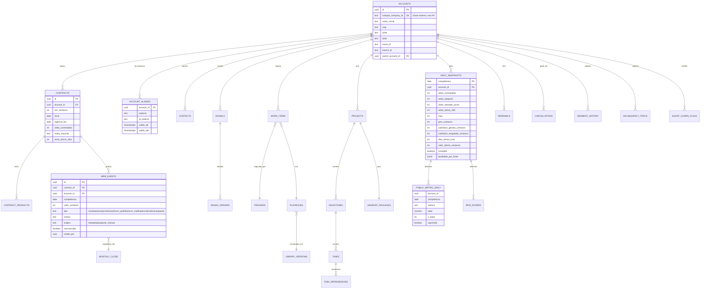

# Alloyal Success — PRD

*Primeira ferramenta do Alloyal Pulse*

| | |
|---|---|
| Documento | 01 — Produto |
| Versão | 2.0 |
| Data | 26 de julho de 2026 |
| Substitui | PRD Alloyal Success v1.0 (23/07/2026) |
| Chassi | `00-PRD-Plataforma-Alloyal-Pulse.md` |
| Pendências | `02-Decisoes-e-Verificacoes-Abertas.md` |
| Status | **Pronto para iniciar a Fase 0.** 2 verificações destravam a Fase 1; 6 decisões destravam a Fase 2 |

---

## 0. O que mudou em relação à v1.0

A v1.0 era um documento forte em governança de dados e segurança. Onze mudanças, das quais **cinco precisam de aval** porque revertem decisões registradas.

| # | Mudança | Por quê | Aval |
|---|---|---|---|
| 1 | Success passa a ser **ferramenta dentro do Alloyal Pulse**, não sistema isolado | Outras ferramentas de ops virão; chassi amortizado, um login, um conceito de cliente | — |
| 2 | **Portal do cliente em domínio próprio, magic link primário**; iframe no `dashboard.cliente` vira evolução | A v1.0 colocava na semana 9 um épico no código de outro time (emissão e assinatura de JWT, CSP, sessão via magic link) sem dono, prazo ou contrato — e o chamava de dependência interna | **Sim** — reverte decisão do Anexo B |
| 3 | **"Fim do PowerPoint" sai do portal e entra no relatório gerado pelo CSM** | O valor de O5 é o relatório, não o self-service. Entregar pelo CSM remove a dependência externa do caminho crítico e antecipa 6 meses | **Sim** |
| 4 | **Detecção de churn silencioso migra da Fase 4c para a Fase 2** | Era o "módulo de maior valor" atrás do gate mais longo do roadmap. Só precisa de Omie + atividade transacional: zero dependências bloqueadas | **Sim** |
| 5 | **Score composto só é publicado depois de calibrado**; até lá, drivers e faixa por regra explícita | Score com pesos adivinhados ensina o time a desconfiar do score — e a desconfiança não se desfaz | **Sim** |
| 6 | **Adesão deixa de ser uma métrica e passa a ser três, nomeadas** | A v1.0 declarava dois denominadores diferentes ("vidas contratadas" e "vidas elegíveis") para a métrica central do produto | **Sim** |
| 7 | Snapshot parcial é publicado e sinalizado; **completude não bloqueia mais o snapshot** | Bloquear significa produto no ar sem número nenhum, e tornava a meta de 100% impossível por construção | — |
| 8 | Fila ganha **teto de carga, deduplicação, carência e modo sombra** | Um motor de gatilhos sem orçamento de volume é como se mata uma ferramenta de CS por fadiga de alerta | — |
| 9 | DEF6 (MRR em PDD) entra no gate da Fase 0; C6–C11 passam a ter fase | Estavam órfãos: DEF6 fora do gate, cinco ciclos fora do roadmap, e o snapshot da Fase 0a dependia de dois deles | — |
| 10 | Roadmap separa **esforço de build** de **lead time**, com gates como linhas | A v1.0 somava 33–34 semanas de essenciais e declarava 32–33; o escopo completo somava 53 e declarava 40–42; e nenhum dos gates de calendário estava contado | — |
| 11 | Instrumentação do CleverTap entra na Fase 0, ao lado da captura de MRR | O histórico de engajamento é tão irrecuperável quanto o de MRR: o relógio começa na instrumentação | — |

---

# PARTE I — PRODUTO

## 1. Problema e tese

O time de CS/CX opera sem sistema. Seis consequências observáveis:

| # | Problema | Como se manifesta hoje |
|---|---|---|
| 1 | Onboarding sem padrão | Cada implantação segue o método de quem conduz; não há previsão de go-live |
| 2 | Risco de churn invisível | Sem indicador consolidado; a queda de adesão aparece na renovação |
| 3 | Insight manual | Toda reunião exige montar apresentação à mão |
| 4 | Sem segmentação | Todo cliente recebe o mesmo tipo de atenção; escalar exige contratar na mesma proporção |
| 5 | Renovação sem pipeline | Não há previsão de receita em risco nem processo de expansão |
| 6 | Sem métricas de receita recorrente | A empresa não tem BI; NRR, churn e coortes não são calculados |

### 1.1 Tese

> Em clube de benefícios B2B2C, saúde do cliente não é frequência de acesso do administrador — é **adesão e engajamento da base final dentro do cliente**.

Esse dado já pertence à Alloyal e nenhuma plataforma de prateleira chega nele sem integração pesada. É o que justifica sistema próprio em vez de licença. O anexo A rastreia item a item o que foi absorvido de 10 plataformas de mercado.

### 1.2 Duas superfícies, uma base

| | **Interna** (Pulse/Success) | **Do cliente** (portal) |
|---|---|---|
| Público | Time Alloyal | Gestor do cliente |
| Onde | Casca do Alloyal Pulse | Domínio próprio, magic link (ADR-011) |
| Risco de erro | Ruído interno | Ligação do comercial |
| Acesso a dados | Esquemas internos, por papel | **Somente `public_v`**, com supressão e RLS |

Compartilham modelo, ingestão, dicionário e motor. Nenhum número é calculado duas vezes — garantido por `packages/metrics` (chassi, 6.5), não por convenção.

---

## 2. Objetivos

Cada objetivo tem fórmula, linha de base, alvo e instrumento. Onde a linha de base não existe, ela é entregável da Fase 0 ou 1.

| # | Objetivo | Métrica e fórmula | Base | Alvo | Instrumento |
|---|---|---|---|---|---|
| **O1** | CSM trabalha por fila, não por painel | `itens fechados dentro do SLA / itens fechados` (SLA por gatilho, seção 9) | — | 80% em 90 dias após F2 | `success.work_item` |
| **O2** | Saúde mensurável e explicável | `contas com sinais atualizados no snapshot do dia / contas ativas` | 0% | ≥98% dos dias com snapshot | `metrics.daily_snapshot` |
| **O3** | Escalar sem escalar headcount | `contas ativas / CSM`, por segmento, **com NPS do gestor estável ou melhor** | Medir em F1 | +30% em 12 meses | Carteira + pesquisas |
| **O4** | Implantação padronizada | `TTFT` = dias entre assinatura e 1ª transação da base | Medir em F1 (histórico da réplica) | −25% em 6 meses após F5 | `success.project` |
| **O5** | Fim do PowerPoint | `contas com ≥1 relatório enviado no trimestre / contas ativas` | 0% | ≥60% | Registro de envio |
| **O6** | Renovação previsível | `abs(previsão − realizado) / realizado`, cenário-base, horizonte de 90 dias | — | ±10% | `success.renewal` |
| **O7** | Métricas de receita confiáveis | `meses com fechamento publicado até D+5 / meses` | — | 100% | `analytics.monthly_close` |
| **O8** | **Ferramenta adotada** | `pessoas com ≥1 sessão útil em 5 dos últimos 7 dias / pessoas com acesso` | — | ≥85% em 90 dias | Telemetria do produto |
| **O9** | **Portal usado e útil** | `contas com ≥1 acesso no mês / contas ativas`; e diferencial de `adesao_30d` entre contas que usam e não usam | — | ≥40% de acesso mensal; diferencial positivo | Telemetria do portal |

**O8 é o objetivo mais importante e o mais frequentemente perdido.** A causa de morte de ferramenta de CS não é falta de função — é o time parar de usar no terceiro mês. Os requisitos D1–D10 do chassi e as regras de fila da seção 9 existem por causa dele.

**O9 é novo.** A v1.0 tinha metade do produto voltado ao cliente e nenhum objetivo além de contagem de PDF.

### 2.1 Não-objetivos

- Ticket, atendimento e base de conhecimento — permanece no Alloyal Hub
- Superfície para o usuário final B2C — o app Alloyal já cobre
- Envio de campanha ao usuário final — permanece no CleverTap; o Pulse envia **segmento**
- PSA completo: timesheet, faturamento de serviços, margem por projeto
- Provisionamento técnico da implantação — handoff ao time responsável
- Analítica de aquisição: personas, campanhas, atribuição
- Aplicativo móvel nativo e comunidade de clientes — reavaliar em 12 meses
- Idioma além de pt-BR

---

## 3. Personas e trabalho a ser feito

| Persona | Frequência | Pergunta que traz à ferramenta | Sucesso para ela |
|---|---|---|---|
| **CSM / CX** | Diária, 4–6 h | "O que eu faço hoje, e por qual cliente começo?" | Fecha a fila sem abrir planilha |
| **Head de CS** | Semanal | "Onde está o risco e a carteira está equilibrada?" | Enxerga risco antes do CSM reportar |
| **Implantação** | Diária no projeto | "O que está travado e por culpa de quem?" | Prevê go-live com confiança |
| **Diretoria** | Mensal | "Como está a receita recorrente e para onde vai?" | Número que não muda sozinho |
| **Financeiro** | Semanal na cobrança, pontual no distrato | "Quem está em risco de crédito e posso liberar este distrato?" | Cobrança relacional antes da judicial |
| **Comercial** | Pontual | "Onde tem expansão qualificada?" | Recebe CSQL com evidência |
| **Gestor do cliente** | Mensal; semanal na implantação | "Meu clube funciona? O que falta de mim?" | Sabe o próximo passo dele |

### 3.1 Jornada crítica — o CSM na segunda-feira

1. Entra na casca do Pulse, cai em **Minha fila**. Vê 7 itens, não 30 — o teto é 12 e a dedup já agiu
2. Item 1: *"Adesão caiu 22% em 30 dias"*, com o gráfico de 90 dias já na linha e o playbook anexado
3. Abre a conta. A queda coincide com uma janela de indisponibilidade do app — a plataforma já correlacionou e escreveu isso
4. Registra o desfecho, dispara a mensagem ao gestor pelo canal da ferramenta (texto preparado, envio dele)
5. Item fecha. O tempo alimenta O1; o desfecho alimenta a calibração do gatilho

Se qualquer passo exigir mais de três cliques ou sair para planilha, O8 falha. Este fluxo é o critério de aceite da Fase 2.

### 3.2 Jornada crítica — o gestor do cliente no dia 20

1. Recebe e-mail: *"Seu clube em julho"*, com três números e um link
2. Abre pelo magic link, sem senha. Vê evolução de 6 meses, comparativo com empresas de porte semelhante, e **uma frase** dizendo o que mudou
3. Vê que a cobertura cadastral está em 61% e que isso limita o resto — com o botão de subir a base
4. Baixa o PDF e leva para a reunião interna dele

O item 3 é o que transforma painel em ferramenta: o portal existe para dizer ao gestor **o que depende dele**.

---

## 4. Escopo funcional

Ordenado por incremento de valor, não por módulo. A coluna "Fase" é a da seção 16.

| # | Módulo | O que entrega | Fase |
|---|---|---|---|
| 4.1 | **Cliente 360** | Visão única: contrato, adesão, resultado, financeiro, suporte, relacionamento, timeline | F1 |
| 4.2 | **Sinais e drivers** | 9 drivers explicáveis, contínuos, com faixa de risco por regra | F1 |
| 4.3 | **Fila de trabalho** | Itens por gatilho, com teto, dedup, carência, modo sombra, desfecho obrigatório | F2 |
| 4.4 | **Churn silencioso** | Matriz engajamento × inadimplência, playbook e dono por faixa | F2 |
| 4.5 | **Biblioteca** | Playbooks, jornadas e scorecards versionados, editáveis sem deploy | F2 |
| 4.6 | **Relatório do cliente** | Renderização + PDF do servidor, enviado pelo CSM | F3 |
| 4.7 | **Segmentação** | High / hybrid / tech-touch por complexidade e profundidade de escuta | F4 |
| 4.8 | **Carteira e capacidade** | Book por CSM, carga, simulação de rebalanceamento | F4 |
| 4.9 | **Implantação** | Templates, dependências, múltiplas visões, inbox, previsão de go-live, handoff | F5 |
| 4.10 | **Score composto** | Score 0–100 calibrado, drivers, override com validade, trava | F6 |
| 4.11 | **Renovação e expansão** | Calendário, previsão em 3 cenários, CSQL para o HubSpot | F7 |
| 4.12 | **Módulo executivo** | Revenue Flows, NRR, GRR, forecast, economics, fechamento | F8 |
| 4.13 | **Retenção** | Churn logo e de receita, exploração, coortes, RFM | F9 |
| 4.14 | **Cancelamento e distrato** | Validação financeira, retenção, gate humano, PDD | F10 |
| 4.15 | **Portal do cliente** | Painel, área de implantação, plano de sucesso | F11 |
| 4.16 | **Ciclo de vida** | Estágios com critério objetivo e automação por estágio | F12 |
| 4.17 | **Plano de sucesso** | Objetivo → Marco → Tarefa, compartilhado com o cliente | F12 |
| 4.18 | **Pesquisas** | NPS do gestor e do usuário final, CSAT, cadência por segmento | F13 |
| 4.19 | **Camada de IA** | Classificação, briefing pré-reunião, leitura do período | F14 |
| 4.20 | **Academia do cliente** | Trilha curta para o gestor divulgar e ler indicadores | F15 |
| 4.21 | **PROFI** | Diagnóstico de maturidade em loyalty, 1 a 5, seis dimensões | F16 |

---

## 5. Dicionário de métricas v0

Isto não é anexo. É o núcleo do produto, e a v1.0 prometia o dicionário em vez de escrevê-lo. Cada linha nasce em `packages/metrics` com dono, fórmula e explicação.

### 5.1 Base e adesão — as três métricas que a v1.0 chamava de uma

| Métrica | Fórmula | Lê-se |
|---|---|---|
`vidas_contratadas` | contrato vigente | Quantas vidas o cliente comprou |
`vidas_elegiveis` | base carregada pelo cliente | Quantas ele efetivamente cadastrou |
**`cobertura_cadastral`** | `vidas_elegiveis / vidas_contratadas` | Quanto do contrato o cliente ativou administrativamente |
`vidas_ativadas_acum` | pessoas com ≥1 uso desde o início | Quantas já usaram alguma vez |
**`adesao_ativacao`** | `vidas_ativadas_acum / vidas_elegiveis` | Alcance histórico. **Nunca cai.** Métrica de implantação |
`vidas_ativas_30d` | pessoas com ≥1 uso em `[d-29, d]` | Quantas usaram no último mês |
**`adesao_30d`** | `vidas_ativas_30d / vidas_elegiveis` | Saúde corrente. **Métrica principal do produto** |

**A palavra "adesão" sem qualificador é proibida** em interface, relatório e conversa. Foi a origem da ambiguidade da v1.0, onde a mesma métrica tinha dois denominadores declarados em fontes diferentes. Um cliente com 1.000 contratadas, 700 elegíveis e 300 ativas tem cobertura de 70%, adesão de 43% — e não tem "adesão de 30%".

**`uso`** = transação concluída ∪ resgate de cashback ∪ sessão no app. Até o CleverTap estar resolvido (V-01/V-02), `uso` = transação ∪ resgate, e a definição é **versão 1**. Quando a sessão entrar, vira versão 2, com quebra visível na série. Não se reescreve o passado (chassi, 6.7).

### 5.2 Resultado e intensidade

| Métrica | Fórmula |
|---|---|
`gmv_centavos` | soma das transações concluídas na competência |
`ticket_medio_centavos` | `gmv / transacoes` |
`transacoes_por_vida_ativa` | `transacoes / vidas_ativas_30d` |
`cashback_gerado_centavos` / `cashback_resgatado_centavos` | soma na competência |
`economia_por_vida_ativa_centavos` | `cashback_gerado / vidas_ativas_30d` — **o número que o gestor entende** |
`mix_por_categoria` | GMV por categoria / GMV total |

### 5.3 Engajamento — depende de V-01/V-02

`mau`, `dau`, `aderencia = dau/mau`, `tendencia_mau_90d`.

### 5.4 Financeiro

`dias_atraso_max` · `valor_em_aberto_centavos` · `faixa_atraso` ∈ {adimplente, 1–30, 31–60, 61–90, >90}

### 5.5 Receita recorrente

`mrr_centavos` é **derivado do ledger de eventos**, nunca lido do campo do HubSpot (ADR-012). O campo do HubSpot é espelho, com alarme quando divergir além de 1%.

```
Revenue Flows da competência:
  mrr_final = mrr_inicial + novo + expansao − contracao − churn_pedido − churn_inadimplencia + reativacao ± ajuste + nao_atribuido
```

| Métrica | Fórmula | Definição pendente |
|---|---|---|
`nrr` | `mrr_final(coorte existente no início) / mrr_inicial` — sem clientes novos | DEF-04 |
`grr` | `(mrr_inicial − contracao − churn) / mrr_inicial` | — |
`churn_logo` | `contas perdidas / contas no início` | DEF-02, DEF-03 |
`churn_receita` | `mrr churn / mrr_inicial` | DEF-02, DEF-03 |
`mrr_em_churn_silencioso` | soma do MRR das contas em faixa ≥ Risco, **quebrado por vetor** | DEF-05 |
`ttft_dias` | `min(data da 1ª transação da base) − data de assinatura` | — |
`ltv`, `payback`, `margem` | conforme dicionário; `cac` depende de fonte externa | V-17 |

`MRR_EVENTS.tipo` ∈ {`novo`, `expansao`, `contracao`, `churn_pedido`, `churn_inadimplencia`, `reativacao`, `ajuste`}. A v1.0 não enumerava e faltavam `reativacao` (cliente em PDD que volta a pagar) e `ajuste` (correção após congelamento).

### 5.6 RFM — atividade da base, deliberadamente sem MRR

| Eixo | Fórmula |
|---|---|
R | dias desde a última transação da base |
F | `transacoes_por_vida_ativa` em 90 dias |
M | `gmv_centavos` em 90 dias |

Quintis dentro do porte, células nomeadas (campeões, leais, em risco, hibernando, novos). Serve para ação em bloco, complementando o score, que é um número.

---

## 6. Sinais, drivers e score

### 6.1 A mudança de sequência

A v1.0 colocava o score composto na Fase 1a. Um score é uma soma ponderada, e os pesos da v1.0 eram estimativa. Score não calibrado erra a ordenação de clientes, o CSM percebe em duas semanas, e **aprende a ignorar o número** — dano que não se desfaz.

Sequência corrigida:

| Fase | O que o CSM vê |
|---|---|
**F1** | Os **drivers**, cada um com valor, direção, origem e carimbo |
**F1** | **Faixa de risco por regra explícita**: qualquer driver em crítico → conta em risco. Explicável em uma frase, confiável desde o dia 1 |
**F6** | **Score 0–100 calibrado**, publicado após 12 semanas de histórico + validação de ordenação com o Head de CS em 20 contas + ajuste de pesos contra desfecho real |

### 6.2 Drivers

Cada driver é contínuo de 0 a 100, nunca binário.

| ID | Driver | Peso inicial | Fórmula (0–100) | Fonte | Pronto |
|---|---|---|---|---|---|
`S-FIN` | Adimplência | **25** | 100 se adimplente; decai linear a 0 em 90 dias de atraso | Omie | F1 |
`S-ADO` | Adesão vs. meta do segmento | 20 | `min(100, adesao_30d / meta_segmento × 100)` | réplica | F1 |
`S-TEN` | Tendência de adesão | 15 | Δ% de `adesao_30d` vs. 30 dias anteriores, normalizado em [−30%, +10%] | réplica | F1 |
`S-USO` | Intensidade | 10 | percentil da base em `transacoes_por_vida_ativa` | réplica | F1 |
`S-CAD` | Cobertura cadastral | 5 | `cobertura_cadastral × 100`, teto 100 | réplica + HubSpot | F1 |
`S-REL` | Recência de relacionamento | 10 | 100 até 30 dias, decai a 0 em 120 | HubSpot + WhatsApp + Calendar | F2 |
`S-SUP` | Suporte | 5 | volume anômalo, SLA estourado, CSAT | Hub (F4) | quando existir |
`S-ENG` | Engajamento | 5 | `aderencia` + tendência de MAU | CleverTap | quando V-01/02 ok |
`S-VOZ` | Voz | 5 | NPS do gestor e do usuário final | Pesquisas | F13 |

**Regra de renormalização.** Driver indisponível tem o peso redistribuído proporcionalmente entre os disponíveis, e o score é marcado **parcial (N de 9)**. Isso é o que permite o score existir antes de todas as integrações, sem mentir sobre a própria completude. Nunca se usa o último valor conhecido de uma fonte parada (chassi, 6.4).

**Faixas:** ≥80 saudável · 60–79 atenção · 40–59 risco · <40 crítico. Faixa carrega rótulo textual e ícone, não só cor (D9).

**Override:** o CSM pode forçar **para vermelho**, fora da soma, com justificativa obrigatória e **validade máxima de 90 dias**. A v1.0 não tinha validade — override esquecido é vermelho permanente que o time aprende a ignorar.

**Trava:** indisponibilidade de app comprovada (F6-lojas) **congela** os drivers de adesão e tendência durante a janela, para não punir o cliente por falha da Alloyal. Isso é diferente de fonte parada, que entra neutra e sinalizada. A v1.0 confundia os dois casos com regras contraditórias.

---

## 7. Churn silencioso

Cliente que ainda não cancelou mas já parou de ser cliente. Módulo de maior valor no modelo B2B2C, e por isso movido para a Fase 2.

| Vetor | Sinal | O que significa |
|---|---|---|
| **Desengajamento** | `adesao_30d` abaixo do piso do segmento por N competências, ou queda sustentada | O clube existe no contrato, não na prática |
| **Inadimplência** | Atraso acumulado | A decisão de sair já foi tomada; a falta de pagamento é a primeira manifestação |

**Inadimplência é churn silencioso, não problema financeiro isolado.** Tratar como cobrança perde a janela em que ainda cabe retenção.

### 7.1 Matriz de severidade

| | Adimplente | 1–30 d | 31–60 d | 61–90 d | > 90 d |
|---|---|---|---|---|---|
| **Engajamento saudável** | Saudável | Atenção | Risco | Risco alto | PDD |
| **Engajamento em queda** | Atenção | Risco | Risco alto | Crítico | PDD |
| **Engajamento baixo** | Risco | Risco alto | Crítico | Crítico | PDD |
| **Engajamento nulo** | Risco alto | Crítico | Crítico | Crítico | PDD |

**Faixas de engajamento (DEF-05, quatro limiares — a v1.0 previa um):**

| Faixa | Regra proposta |
|---|---|
Saudável | `adesao_30d ≥ piso do segmento` |
Em queda | queda ≥ 15% em 2 competências consecutivas, ainda acima do piso |
Baixo | entre 40% e 100% do piso |
Nulo | `< 40%` do piso, ou zero transações em 60 dias |

Donos: **Atenção e Risco** → CSM · **Risco alto** → CSM com ciência da liderança · **Crítico** → liderança de CS + Financeiro · **PDD** → Financeiro, fluxo 7.3.

**Uma conta em faixa ≥ Risco gera um único item de trabalho** (família `churn_silencioso`), não um por vetor. A v1.0 permitia que o mesmo atraso de pagamento produzisse queda de score, item de churn silencioso e escalonamento de cobrança — três notificações para um fato, que é como se ensina o time a silenciar a ferramenta.

### 7.2 Métrica executiva

`mrr_em_churn_silencioso`, **quebrado pelos dois vetores**. Permite à diretoria separar problema de produto (desengajamento) de problema de crédito (inadimplência) — que exigem respostas diferentes e, somados, escondem os dois.

**Calibração contínua:** tempo médio entre entrada em churn silencioso e cancelamento formal, por vetor. É o que valida se o sinal antecipa o suficiente para caber ação. Se der 10 dias, o módulo não serve e precisa de limiar mais sensível.

### 7.3 PDD — churn iniciado pela Alloyal

```
30 d  →  item ao CSM: cobrança relacional
60 d  →  escalonamento à liderança de CS e ao Financeiro
         avaliação de suspensão de acesso
90 d  →  PDD: provisão contábil + churn iniciado pela Alloyal
         notificação formal de rescisão por inadimplemento
         GATE HUMANO DO FINANCEIRO (nunca do CS, nunca automático)
         distrato pelo fluxo 4.14, motivo churn_inadimplencia
```

**Efeito na receita — decisão contábil, não de produto (DEF-06).** Conta em PDD tem o MRR retirado da base ativa e classificado como `churn_inadimplencia`. Sem essa regra, o MRR informado infla com receita não recebida e o NRR fica otimista de forma sistemática. **Se o cliente voltar a pagar, entra evento `reativacao`** — caso que a v1.0 não previa.

| | A pedido do cliente | Por inadimplência |
|---|---|---|
| Quem inicia | Cliente | Alloyal |
| Aprovador | CS / liderança | **Financeiro** |
| Base legal | Cláusula de rescisão | Rescisão por inadimplemento |
| Multa | Conforme cláusula | Normalmente não aplicável; débito segue em cobrança |
| Motivo | Taxonomia de cancelamento | `churn_inadimplencia` |
| Retenção | Playbook obrigatório | Tentativa de acordo, pelo Financeiro |

Manter as categorias separadas é o que responde a pergunta que a diretoria vai fazer: **quanto do churn é insatisfação e quanto é crédito?**

---

## 8. Implantação

Onde o TTFT é decidido e onde a adesão futura é ganha ou perdida.

**Interno (F5):** templates por tipo de contrato · tarefas com dependência e caminho crítico · visões lista, kanban, gantt e calendário · inbox único de mensagens do projeto · **previsão de go-live** derivada de dependências e histórico · pacote de handoff que é **rejeitado quando incompleto**.

**Do cliente (F11, ou por formulário com magic link antes):** aprovação de escopo · cronograma visível · checklist do que depende dele · **upload da base elegível** · agendamento · pendências.

O item que mais move o TTFT é a carga da base elegível, e ela depende do cliente. Por isso `cobertura_cadastral` é driver de score desde a F1 e gatilho de item desde a F2 — mesmo antes de existir portal.

---

## 9. Catálogo de gatilhos e orçamento de fila

A peça que faltava na v1.0: um motor de gatilhos sem modelo de volume gera fadiga de alerta, que é exatamente a morte prevista em O8.

| ID | Gatilho | Condição | Prior. | SLA | Dono | Família | Carência | Volume est. /100 contas/mês |
|---|---|---|---|---|---|---|---|---|
`G-01` | Atraso 30 d | `30 ≤ dias_atraso < 60` | Alta | 3 d | CSM | financeiro | 30 d | 8–15 |
`G-02` | Atraso 60 d | `60 ≤ dias_atraso < 90` | Crítica | 2 d | CS lead + Fin | financeiro | 30 d | 3–6 |
`G-03` | PDD | `dias_atraso ≥ 90` | Crítica | 1 d | Financeiro | financeiro | — | 1–3 |
`G-04` | Queda de adesão | `Δ adesao_30d ≤ −20%` em 30 d | Alta | 5 d | CSM | adesao | 45 d | 5–12 |
`G-05` | Adesão sob o piso | `< piso do segmento` por 2 competências | Média | 10 d | CSM | adesao | 60 d | 10–20 |
`G-06` | Base não carregada | `cobertura_cadastral < 60%` em go-live+30 d | Alta | 5 d | CSM | onboarding | 30 d | 2–5 |
`G-07` | Churn silencioso | célula ≥ Risco | Alta/Crítica | 2–5 d | por faixa | churn_silencioso | 30 d | 5–10 |
`G-08` | Sem contato | `dias_desde_ultimo_contato > 60` | Média | 10 d | CSM | relacionamento | 45 d | 8–15 |
`G-09` | Renovação | 90 d da vigência | Alta | janela | CSM | renovacao | — | base ÷ 12 |
`G-10` | Detrator | `NPS ≤ 6` | Alta | 2 d | CSM | voz | 30 d | por cadência |
`G-11` | App indisponível | indisponibilidade > 4 h | Alta | 1 d | CSM | produto | 7 d | eventual |
`G-12` | Marco atrasado | marco vencido | Alta | 2 d | Implantação | onboarding | — | por projeto |
`G-13` | Expansão | adesão alta + produto ausente | Baixa | 20 d | CSM → Comercial | expansao | 90 d | 3–8 |
`G-14` | Reclassificação | mudança de segmento | Baixa | 10 d | CS lead | carteira | — | eventual |

**Orçamento.** Volume bruto estimado: 45 a 100 itens por 100 contas por mês. Deduplicação por família e teto de 12 abertos por pessoa reduzem a fila visível; o excedente vai para backlog priorizado. **Não é possível fechar esse número sem a volumetria (V-05):** com 300 contas e 4 CSMs, são 34 a 75 itens por CSM por mês, o que é operável; com 1.500 contas e 4 CSMs, não é — e a resposta passa a ser segmentação tech-touch antes da fila, não fila maior.

**Modo sombra, 14 dias, obrigatório para todo gatilho novo.** Itens visíveis só para a liderança, que aprova a promoção. Nenhum gatilho vai direto à fila do time — inclusive na partida.

**Partida a frio.** O backfill vai satisfazer condições históricas de todos os gatilhos ao mesmo tempo. Na primeira execução: apenas gatilhos com condição no estado corrente (financeiro, cobertura, adesão sob o piso) são elegíveis; gatilhos de variação (`G-04`, `G-08`) só a partir de 30 dias de série própria. Sem essa regra, o dia 1 entrega uma fila de centenas de itens, e o time nunca volta.

---

## 10. Superfície do cliente

### 10.1 Sequência: relatório antes de portal

| Etapa | Fase | Como o cliente recebe | Dependência externa |
|---|---|---|---|
| **Relatório** | F3 | PDF gerado no servidor, enviado pelo CSM | **Nenhuma** |
| **Portal** | F11 | Domínio próprio, magic link | Nenhuma |
| **Módulo no `dashboard.cliente`** | Depois | iframe + `postMessage` | Time do dashboard |

O mesmo renderizador serve os três. O valor de O5 chega na semana 14 em vez de depender de um contrato de interface com outro time na semana 9.

### 10.2 Conteúdo do portal

| Módulo | O que mostra | Fase |
|---|---|---|
Painel de resultado | Evolução de 12 meses, comparativo, benchmark anônimo, leitura automática, PDF | F11 |
**O que depende de você** | Cobertura cadastral, comunicação, pendências — com ação | F11 |
Área de implantação | Escopo, cronograma, checklist, upload de base, agendamento | F11 |
Plano de sucesso | Progresso dos objetivos, o que depende de cada lado | F12 |
Academia | Trilha curta: divulgar, usar banners, ler indicadores, campanha sazonal | F15 |

**Fora do portal, e a combinar com o comercial antes de vender:** health score visível ao cliente, narrativa de IA publicada, acompanhamento de item de trabalho interno.

**Sobre a academia:** adesão depende mais do gestor do que da Alloyal. Gestor que não sabe divulgar produz clube parado, e o CSM absorve isso como trabalho recorrente. É o item mais barato com maior efeito sobre a métrica principal — e a razão de O9 medir o diferencial de adesão entre quem usa e quem não usa o portal.

---

## 11. Especificação de design das telas centrais

### 11.1 Minha fila — a tela que decide O8

```
┌─────────────────────────────────────────────────────────────────────┐
│ Alloyal Pulse  ▸ Success            [Minha fila] Carteira  Contas  ⚙ │
├─────────────────────────────────────────────────────────────────────┤
│ Minha fila · 7 itens · 2 vencem hoje              Backlog (14) ▸    │
├─────────────────────────────────────────────────────────────────────┤
│ ● Crítica  Construtora Vega            vence hoje                   │
│   Atraso de 63 dias · R$ 18.400 em aberto · engajamento em queda    │
│   → Escalonar ao Financeiro          [Abrir conta] [Registrar]      │
├─────────────────────────────────────────────────────────────────────┤
│ ● Alta     Grupo Meridiano             vence em 2 dias              │
│   Adesão 30d caiu 22% (41% → 32%) · coincide com 6h de app fora     │
│   → Playbook: queda com causa técnica  [Abrir conta] [Registrar]    │
├─────────────────────────────────────────────────────────────────────┤
│ ○ Média    Têxtil Aurora               vence em 9 dias              │
│   Cobertura cadastral 58% após 45 dias de go-live                   │
│   → Playbook: cobrar carga da base    [Abrir conta] [Registrar]     │
└─────────────────────────────────────────────────────────────────────┘
```

Regras: **motivo em linguagem natural com o número dentro**, nunca "score caiu" · evidência na própria linha, sem clique · ação primária explícita · sem filtros na primeira dobra (ordenação é responsabilidade do sistema, não do CSM — D4) · backlog atrás de um clique, jamais na fila · nenhum item sem prazo.

### 11.2 Cliente 360

Cabeçalho fixo: razão social · segmento · CSM · faixa de risco (rótulo + ícone + cor) · MRR · vigência · **quatro números**: `adesao_30d`, `cobertura_cadastral`, `faixa_atraso`, `dias_desde_ultimo_contato`.

Abas: **Visão** (drivers com sparkline de 90 d) · **Adesão** (as três métricas, cortes) · **Resultado** (GMV, cashback, economia por vida, mix) · **Financeiro** · **Suporte** · **Relacionamento** (timeline unificada de e-mail, reunião, WhatsApp, itens) · **Plano** · **Timeline**.

Todo número é `<Metric/>`: clique abre fórmula, fonte, ciclo e horário (D6, automático via envelope de linhagem).

### 11.3 Relatório do cliente

Uma página, quatro blocos: **o que aconteceu** (3 números + variação) · **evolução** (12 meses) · **comparativo** (porte semelhante, anônimo, com N declarado) · **o que depende de você** (2 a 3 ações). Uma frase de leitura automática, revisável pelo CSM antes do envio. PDF renderizado no servidor a partir do mesmo componente da tela — paridade por construção, não por conferência.

### 11.4 Estados obrigatórios em toda tela

`ok` · `defasado` (âmbar + data) · `parcial` (lista o que falta) · `suprimido` (explica a regra de N mínimo e o que fazer) · `em verificação` (incidente de dado aberto).

---

# PARTE II — DADOS E ENGENHARIA

Mecânica geral no documento 00. Aqui, o que é específico do Success.

## 12. Fontes e ciclos, com fase

| ID | Fonte | Método | Frequência | Em falha | Fase |
|---|---|---|---|---|---|
`C1` | Réplica — transações | incremental por watermark | 15 min | 3 tentativas, backoff, alarme após 2 ciclos | F1 |
`C2` | Réplica — base elegível/ativada | full | diário 02:00 | alarme; snapshot parcial | F1 |
`C3` | Réplica — reconciliação 90 d | full | diário 04:00 | alarme + `ops.divergencia` | F1 |
`C4` | HubSpot — contratos e contatos | incremental | 4 h | retry; último valor com marca de defasagem | F1 |
`C5` | HubSpot — **eventos de MRR** | webhook + varredura diária | contínuo | **alarme crítico — perda irrecuperável** | **F0** |
`C6` | CleverTap — engajamento | agregado | diário 05:00 | `S-ENG` neutro e sinalizado | F2 |
`C7` | Hub — tickets | webhook + agregado diário | contínuo | fallback no agregado | quando F4 existir |
`C8` | Omie — adimplência | full | diário 06:00 | `S-FIN` neutro e sinalizado | **F1** |
`C9` | Lojas — disponibilidade | webhook + varredura 6 h | contínuo | varredura cobre; trava mantida | F2 |
`C10` | WhatsApp | webhook | contínuo | fila de reprocessamento | F2 |
`C11` | Calendar | sob demanda + varredura | diário | retry | F2 |
`C12` | **Snapshot diário** | consolidação | diário 07:00 | publica **parcial e marcado** | F1 |

Correção da v1.0: cinco ciclos não tinham fase, e o snapshot da primeira fase dependia de dois deles.

```
02:00  C2   base elegível/ativada
04:00  C3   reconciliação de 90 dias
05:00  C6   engajamento
06:00  C8   adimplência
07:00  C12  SNAPSHOT  ← espera C2, C3, C6, C8; se algum faltar, publica PARCIAL
       ├─→ drivers e faixa de risco
       ├─→ avaliação de gatilhos → itens de trabalho
       └─→ atualização de public_v
07:30  SLO de publicação
```

`C1` roda a cada 15 min em paralelo e não espera o snapshot: transação do dia corrente entra no snapshot de amanhã.

**"Espera" ≠ "bloqueia".** A v1.0 usava as duas palavras como sinônimo em seções diferentes. Aqui: o snapshot espera os ciclos até 06:50; o que não chegou entra como lacuna marcada.

## 13. Catálogo de dados — o que falta existir

Criticidade **B** = sem ele o módulo não existe.

### 13.1 Bloqueantes

| # | Dado | Fonte | Bloqueia | Verificação |
|---|---|---|---|---|
1 | `updated_at` confiável em `orders` | réplica | C1 inteiro | **V-01** |
2 | Índice em `orders` por (`brand_id`,`branch_id`,data) no primary | réplica | viabilidade de desempenho | **V-02** |
3 | `hubspot_id` (ou chave mapeável) na base Alloyal | réplica | chave canônica | V-04 |
4 | Eventos de MRR no HubSpot: quais e desde quando | HubSpot | série histórica | V-06 |
5 | Chave de junção do Omie | Omie | `S-FIN`, churn silencioso, PDD | **V-07** |
6 | `hubspot_id` no perfil CleverTap + campo `Identity` | CleverTap | `S-ENG`, MAU por conta | V-08, V-09 |
7 | Vidas contratadas, elegíveis e ativadas | HubSpot + réplica | as três métricas de adesão | — |

### 13.2 Importantes

Razão social, CNPJ, porte, setor (segmentação e benchmark) · início de contrato (coortes, TTFT) · vigência e renovação · cláusula de multa e aviso prévio (V-10) · owner comercial e CSM · hierarquia matriz/filial (`brand_id` × `branch_id`) · produtos contratados **como tabela, não string** · opt-in · status do pedido e estorno · parceiro e categoria · tickets, taxonomia fechada de motivos (V-13), CSAT, SLA · NPS do gestor **e** do usuário final, separados · atividade de e-mail, reunião e WhatsApp · comparecimento em reunião · mapa de stakeholders · débito em aberto · disponibilidade e histórico de indisponibilidade dos apps (V-14) · investimento de marketing (V-17).

## 14. Modelo de dados do Success



Cinco correções em relação ao ERD da v1.0:

| # | Correção |
|---|---|
1 | **PK interna uuid**; `hubspot_company_id` é chave externa única, com `ACCOUNT_ALIASES` para sobreviver a merge de company no HubSpot e a contas sem id (ADR-006) |
2 | `MRR_EVENTS` ganha as chaves estrangeiras que faltavam, `origem`, `reconstruido` e `criado_por` — sem elas não há como separar dado capturado de dado reconstruído, que a própria v1.0 exigia |
3 | **`PUBLIC_METRIC_DAILY` ganha `competencia`** — sem dimensão de tempo a view não servia o módulo principal do portal, que é evolução. Ganha também `suprimido`, para a interface poder explicar a supressão em vez de mostrar vazio |
4 | `DAILY_SNAPSHOTS` ganha `vidas_contratadas` (sem ela nenhuma das três métricas de adesão fecha), `completo` e `qualidade_por_fonte` |
5 | `CONTRACT_PRODUCTS` como tabela, resolvendo multi-produto por cliente (clube + Telemed em contratos distintos) |

---

# PARTE III — EXECUÇÃO

## 15. Time

A v1.0 propunha 6,5 FTE sem QA, sem infra e com designer em meio período num produto cujo risco número 1 é abandono por experiência.

| Papel | Alocação | Responsabilidade |
|---|---|---|
Product Manager | 1 integral | Escopo, prioridade, definições com CS e diretoria, dicionário |
**Product Designer** | **1 integral até a F4**, meio depois | Fila, Cliente 360, relatório, portal, D1–D10, pesquisa com CSMs |
Engenheiro de Dados | 1 integral | Ciclos, qualidade, linhagem, fechamento |
Dev Backend | 2 integral | API, domínio, integrações, MCP |
Dev Frontend | **2 integral** | Casca, Success, portal — a v1.0 tinha 1 para dois produtos e 8 fases de UI |
Tech Lead | 1 meio período | Arquitetura, revisão, segurança |
**QA / automação** | **1 meio período** | Suíte de isolamento de tenant, e2e, checklist de lançamento |
**Infra / SRE** | **1 meio período** | Deploy, backup e restauração, observabilidade, plantão |
**Data Owner** | **indicado, com tempo alocado** | Dicionário e fechamento mensal — processo recorrente, para sempre |

Sem os três papéis marcados, o plano da seção 16 não se sustenta: há 25 critérios de lançamento, vários de segurança, restauração de backup trimestral e um canal de plantão.

## 16. Roadmap

Duas colunas, porque a v1.0 misturava as duas coisas: **esforço** é trabalho do time; **lead time** inclui gates que dependem de calendário e de clientes reais.

| Fase | Entrega de valor | Esforço | Gate de saída | Lead do gate | Semana |
|---|---|---|---|---|---|
**F0** | Fundação: repo, CI, ambientes, SSO, design system v0, **spike de dados**, captura de MRR, instrumentação do CleverTap | 3 sem | V-01 e V-02 respondidos; DEF-01 a DEF-04 e DEF-06 fechadas | — | **3** |
**F1** | **Cliente 360 + drivers + faixa de risco.** Ciclos C1–C4, C8, C12. Linha de base de TTFT, adesão e churn | 4 sem | 20 contas reconciliadas em 3 períodos, validadas por CS | 2 sem, paralelo | **7** |
**F2** | **Fila de trabalho + churn silencioso.** Biblioteca. Ciclos C6, C9–C11 | 4 sem | 14 dias de modo sombra aprovados pela liderança | 2 sem, paralelo | **13** |
**F3** | **Relatório do cliente** — fim do PowerPoint | 3 sem | 10 relatórios enviados a clientes reais | 1 sem | **14** |
**F4** | Segmentação, carteira, capacidade | 3 sem | Rebalanceamento executado | — | **17** |
**F5** | Implantação (interno) | 4 sem | **3 implantações conduzidas pelo sistema** | **8–12 sem** ⚠ | **21** (gate até 33) |
**F6** | Score composto **calibrado** | 2 sem | 12 sem de histórico + validação de ordenação | já decorrido | **23** |
**F7** | Renovação, expansão, CSQL | 3 sem | 1 ciclo de renovação conduzido | 4 sem | **26** |
**F8** | Módulo executivo, Revenue Flows, NRR, fechamento | 4 sem | **2 fechamentos publicados em D+5** | **8 sem** ⚠ | **30** (gate até 38) |
**F9** | Retenção, exploração, coortes, RFM | 3 sem | — | — | **33** |
**F10** | Cancelamento e distrato | 4 sem | Aval jurídico + 1 distrato completo | 2 sem | **37** |
**F11** | **Portal do cliente** | 4 sem | Critérios 17.3, todos | 2 sem | **41** |
**F12** | Ciclo de vida + plano de sucesso | 3 sem | — | — | 44 |
**F13** | Pesquisas NPS e CSAT | 2 sem | — | — | 46 |
**F14** | Camada de IA | 3 sem | — | — | 49 |
**F15** | Academia do cliente | 2 sem | — | — | 51 |
**F16** | PROFI | 4 sem | — | — | 55 |

**Leitura honesta do prazo:**

- **Semana 7 — o CSM para de montar planilha.** Cliente 360 com números reconciliados
- **Semana 13 — a fila entra em operação.** É quando o produto começa a existir
- **Semana 14 — fim do PowerPoint**
- **Semana 41 — conjunto essencial em produção**, incluindo portal. ≈ **9 a 10 meses**
- **Semana 55 — escopo completo.** ≈ 13 meses

Os gates da F5 e da F8 estão marcados com ⚠ porque **não são esforço, são espera**: três implantações completas dependem do TTFT real (que só é medido na F1) e dois fechamentos mensais são dois meses de calendário. Eles não param o time — a F6 e a F7 avançam em paralelo — mas param a **promoção** daquelas entregas. Um plano que não mostra isso estoura na semana em que alguém cobra.

**O que não pode esperar** (irrecuperável, entra na F0):

1. **Captura de eventos de MRR.** Cada mês sem captura é um mês a menos de série confiável. E, entre a F0 e a F7, não existe fluxo próprio gerando esses eventos: as mudanças acontecem no HubSpot, por pessoas. Ou seja, C5 precisa de **mecanismo de webhook de mudança de propriedade de deal**, verificado antes (V-11) — é o único ciclo marcado como perda irrecuperável e era o menos especificado da v1.0.
2. **Instrumentação do `hubspot_id` no CleverTap.** A instrumentação não é retroativa: o relógio do histórico começa quando ela é feita, e a F9 precisa de N competências de MAU. Custa quase nada agora e é impossível depois.
3. **Pesquisa com CSMs** — cinco entrevistas e uma sessão de observação de rotina, antes de desenhar a fila. Sem isso, a fila reflete a opinião de quem escreveu o PRD. É a causa raiz mais comum de abandono no terceiro mês.

## 17. Critérios de lançamento

### 17.1 Dados
- Reconciliação com a fonte para 20 contas em 3 períodos, dentro da tolerância do dicionário
- Reexecutar qualquer ciclo não duplica nem altera competência congelada
- Dado defasado, parcial ou suprimido é sempre sinalizado
- **Paridade interno/portal:** para a mesma conta e competência, o número é idêntico **ou o portal exibe estado `suprimido` com a regra explicada**. A v1.0 exigia identidade absoluta e simultaneamente supressão abaixo de N=5 — dois critérios que se contradiziam

### 17.2 Superfície interna
- Item de trabalho chega à pessoa correta dentro do SLA declarado
- Nenhum sinal aparece sem driver e sem procedência
- Reclassificação de segmento gera item, nunca acontece em silêncio
- Pacote de handoff é rejeitado quando incompleto
- **Bloqueante:** nenhum caminho de código gera ou envia distrato sem aprovação humana registrada
- **Bloqueante:** validação financeira não pode ser pulada
- **Bloqueante:** MCP não expõe operação destrutiva (lista branca verificada no CI)
- Teto de fila, dedup, carência e modo sombra ativos e testados

### 17.3 Portal — todos bloqueantes
- Nenhuma resposta devolve recorte abaixo do N mínimo sem o estado `suprimido`
- **Para cada rota:** token do cliente A com identificador do cliente B em query, path, corpo ou header → **403 + registro**
- Nenhuma rota alcança esquema fora de `public_v`
- Com RLS **forçado**, consulta sem `app.current_tenant` retorna vazio; role da API não é owner e não tem `BYPASSRLS`
- `app.current_tenant` é transaction-local e não vaza entre requisições no pool — teste específico
- Magic link: expirado, reutilizado ou aberto por e-mail diferente é rejeitado e registrado
- `frame-ancestors` bloqueia domínio não autorizado
- PDF do servidor confere com a tela (mesmo componente)
- Nenhum campo expõe consumo individual identificável

### 17.4 Operação
- Painel de pipeline em produção **antes do primeiro dado real**
- Alarme testado com falha induzida, por ciclo
- Restauração de backup testada
- Rollback executado em staging
- ROPA, RIPD e fluxo de direito do titular concluídos antes da primeira carga real

## 18. Riscos

Com dono, gatilho de acionamento e resposta — a v1.0 tinha impacto e mitigação, mas ninguém responsável.

| Risco | Dono | Gatilho | Resposta |
|---|---|---|---|
`updated_at` decorativo em `orders` | Eng. Dados | V-01 negativo | Reconciliação de 90 d como caminho principal; janela ampliada para 180 d na carga inicial |
Sem índice no primary | Tech Lead | V-02 negativo | Índice, ou tabela materializada de agregados na origem, ou janela noturna ampliada |
Janela noturna não caber | Eng. Dados | Spike > 3 h | Particionamento por conta, paralelismo por lote, snapshot em duas passadas |
CleverTap sem `hubspot_id` | PM | V-08 negativo | `S-ENG` renormalizado a zero peso; engajamento medido por transação até haver série |
Histórico de MRR parcial | Data Owner | V-06 | Resíduo `nao_atribuido` visível; passado marcado `reconstruido`; Pulse é fonte a partir da F0 |
**MRR divergir entre Pulse e HubSpot** | RevOps | divergência > 1% | Alarme diário; o Pulse é a fonte (ADR-012) e o campo do HubSpot é espelho |
Fadiga de alerta mata a fila | Head de CS | > 12 itens abertos por CSM por 2 semanas, ou > 20% de falso positivo | Recalibrar limiares; segmentar tech-touch antes de aumentar fila |
Abandono pelo time de CS | Head de CS | O8 < 60% em 60 dias | Parar o roadmap e fazer pesquisa; nenhuma fase nova antes de recuperar |
Primeiro BI sem governança | Data Owner | qualquer número histórico mudar | Congelamento; ajuste só na competência corrente |
API do Hub depende de outro time | PM | sem OpenAPI acordado até a F1 | `S-SUP` renormalizado a zero; mock no Pulse; suporte sai do score |
Dependência do `dashboard.cliente` | PM | contrato não assinado | ADR-011 já removeu do caminho crítico; iframe fica como evolução |
Número errado exposto a cliente | Data Owner | incidente aberto | Playbook de incidente de dado (chassi, 6.8) |
DEF-01 definida errada | Diretoria | — | Três métricas nomeadas em vez de uma; a decisão passa a ser de piso por segmento, não de definição |
Escopo completo tratado como MVP | PM | cobrança do prazo de 55 semanas | Marcos de valor das semanas 7, 13 e 14 são o contrato; o resto é incremento |
Squad sem QA e sem SRE | Tech Lead | F1 concluída sem os papéis | Reduzir escopo por fase; não há como cumprir 17.3 e 17.4 sem eles |

## 19. Registro de premissas

O que estamos assumindo, e o que invalida cada premissa. Ausente na v1.0, e é onde os planos morrem.

| # | Premissa | Confiança | Invalida se |
|---|---|---|---|
A1 | A réplica suporta a janela noturna | **Baixa** | Spike da F0 medir > 3 h |
A2 | `hubspot_id` cobre a base de clientes | Média | V-04 mostrar lacunas — `ACCOUNT_ALIASES` já mitiga |
A3 | O HubSpot registra mudança de MRR de forma capturável | **Baixa** | V-11 — sem isso o MRR precisa de entrada manual assistida na F0 |
A4 | O Omie tem chave junção com a base de clientes | Média | V-07 — sem isso o driver de maior peso não existe |
A5 | Existe volume de churn suficiente para calibrar o score | Média | Menos de 10 churns em 12 semanas → calibração por ordenação humana |
A6 | 4 a 6 CSMs operando a fila na F2 | Alta | Menos de 3 → não há como validar O1 nem o modo sombra |
A7 | Piso de adesão por segmento pode ser derivado do histórico | Média | Histórico curto → piso definido por CS e revisado a cada trimestre |
A8 | O gestor do cliente abre e-mail e clica em magic link | Média | Taxa de abertura < 25% → o relatório vira anexo enviado pelo CSM |

---

## Anexo A — Auditoria do benchmark

| Origem | Item | Status | Onde |
|---|---|---|---|
Gainsight | Customer 360 · Scorecards com drivers · CTA/Cockpit · Success Plans · Renewal Center e CSQL · Journey Orchestrator · Survey com detrator disparando ação · Timeline · Vault · AI Cheat Sheet · Mapa de stakeholders | Absorvido | 4.1, 4.2, 4.3, 4.11, 4.16, 4.17, 4.18, 4.19 |
Gainsight | App móvel nativo · Comunidade de clientes | Descartado | Responsivo a partir de 768 px (D8) |
Totango | SuccessBLOCs · Jornada por segmento | Absorvido | 4.5, 4.7 |
ChurnZero | Jornadas automatizadas | Absorvido | 4.16 |
ChurnZero | In-app messaging | Delegado | CleverTap |
Vitally | UX que sustenta adoção · Modelos tech/hybrid/high-touch | Absorvido | Seção 11, 4.7 |
SenseData | Dados acionáveis, régua pt-BR, LGPD | Absorvido | 4.2, chassi 13 |
Rocketlane / GUIDEcx | Tarefas com dependência · Previsão de go-live · Acesso do cliente sem login · Inbox global · Múltiplas visões | Absorvido | 4.9, 5.3 do chassi |
Rocketlane | Capacidade e alocação | Parcial | 4.8 — sem timesheet nem margem |
EverAfter | Hub do cliente · Customer academy | Absorvido | 4.15, 4.20 |
Valuecase | Compatibilidade com agentes via MCP | Absorvido | Chassi 14 |
Mercado 2026 | Business review gerado por IA | Absorvido | 4.19 |
GrowthAnalysis | Resumo da base · Revenue Flows · NRR · Forecast · Churn e coortes · Churn silencioso · RFM | Absorvido | 4.12, 4.13, 7 |
GrowthAnalysis | Economics | Parcial | CAC depende de fonte externa (V-17) |
GrowthAnalysis | PMF Produto | Consolidado em | 4.18 |
GrowthAnalysis | Personas · Campanhas · Atribuição | Descartado | Analítica de aquisição, fora de escopo |

## Anexo B — PROFI (F16)

Diagnóstico de maturidade em loyalty, 1 a 5, aplicado pelo time de implantação. **O valor não é classificar** — é transformar "sua adesão está baixa" em "sua adesão está baixa porque você está no nível 2, onde ainda não existe calendário de comunicação, e o próximo passo é este".

**Níveis:** 1 Inicial (benefício avulso, sem objetivo nem responsável) · 2 Estruturado (objetivo e responsável, comunicação pontual) · 3 Gerenciado (meta, calendário, indicadores) · 4 Otimizado (segmentação, campanhas por perfil, teste e ajuste, orçamento) · 5 Estratégico (integrado à estratégia de RH e negócio, ROI medido, patrocínio executivo).

**Dimensões:** D1 objetivo e patrocínio · D2 governança e recursos · D3 comunicação e ativação · D4 dados e mensuração · D5 integração com processos internos · D6 experiência do beneficiário.

**Pontuação:** cada pergunta pertence a uma dimensão e carrega peso; dimensão = média ponderada normalizada de 1 a 5; PROFI = média ponderada das seis. **Regra do elo mais fraco: o nível geral não excede em mais de 1 a menor dimensão** — porque modelo de maturidade que só tira média esconde exatamente o que interessa. Cliente com comunicação excelente e ninguém responsável não é nível 4; é frágil.

**Saída:** para cada dimensão, a ação que move do nível atual para o seguinte — não o estado ideal, que é inútil para quem está no nível 1. Priorização por impacto na adesão × esforço, e os passos viram objetivos no plano de sucesso (4.17).

**Integração:** alimenta o eixo de complexidade da segmentação (até a F16, o eixo usa proxy de porte × cobertura × canais, e a chegada do PROFI reclassifica a base — evento previsto, com item de trabalho em lote) · **não entra no score como driver: é causa, não sintoma** · define trilha na academia · PROFI baixo com adesão baixa qualifica conversa de serviço.

**Cadência:** primeira aplicação na implantação; reavaliação anual ou na renovação. A evolução entre aplicações é indicador antecedente — cliente que não sai do nível 2 em dois ciclos tende a churn mesmo com adesão estável.

**Pendência:** as perguntas e os pesos existem do lado da Alloyal. São necessários para mapear pergunta → dimensão e calibrar a normalização (DEF-10).
